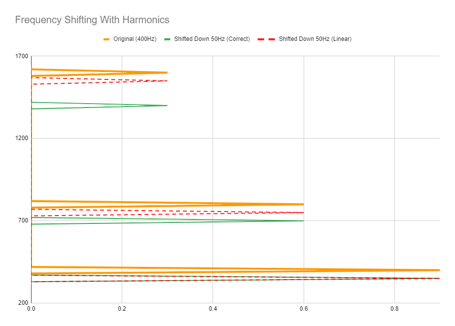
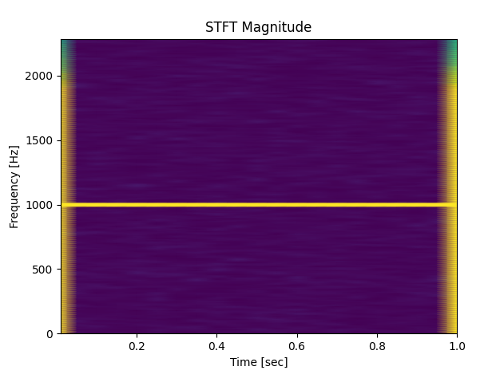
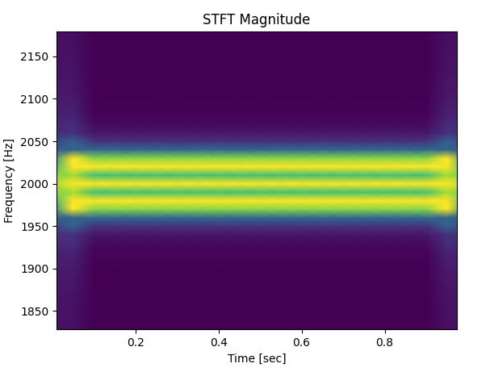
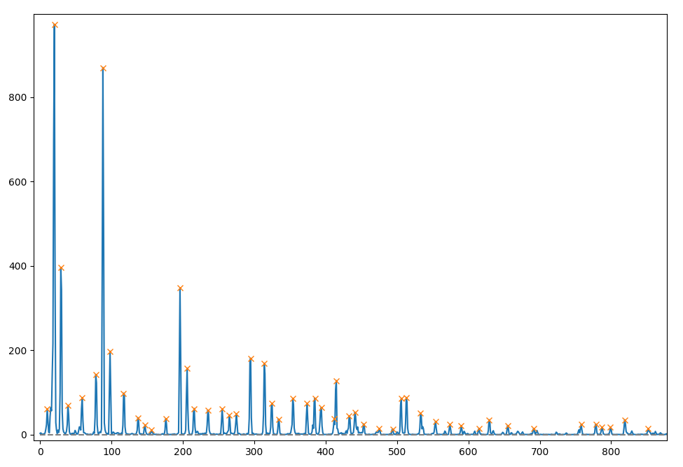

# CS410P: Computers, Sound, & Music
# 🤖 Pitch Bot 9000 🤖

## Group Members
* Christopher Juncker ([juncker@pdx.edu](mailto:juncker@pdx.edu)) 
* Clara Stickney ([cstick2@pdx.edu](mailto:cstick2@pdx.edu)) 


<br>

## Topic

The goal of our project is to learn about pitch-shifting and pitch correction. 
In order to accomplish our goal, we have written a Python program whose purpose 
is to accept a WAV file as input, and to return a new pitch-shifted WAV file as 
output. We will begin our writeup by giving some instructions on how to install 
and run our program. Following that, we will provide some examples of the results 
of our program, comparing our initial goal to both our final and intermediate 
results. We will conclude by summing up what we have learned, what we think turned 
out well, and what we wish had turned out better.


<br>

## Instructions

In order to successfully run our project, one simply needs to install the necessary
libraries and run the program as described below:


<br>

### Installation

The following Python libraries are required:

* scipy.io.wavfile
* scipy
* numpy
* matplotlib
* pyaudio

<br>

### Initialization

Our program is intended to be run via the command line:

```bash
python pitchbot.py <input_file> <direction> <num_steps>
```

```python
# where:
input_file = "file.wav" # [string] The name of the input WAV file
direction = "up" | "down" # [string] The direction of the pitch shift
num_steps = 1.5 # [float] The number of whole steps to shift
```

After successfully initializing and running the program, the pitch shifted file 
will be renamed and saved in the same folder as the original file.


<br>

## Pitch Shifting

This project has been a great learning opportunity as we have learned about the 
basics of shifting pitch using the Fast Fourier Transform. We have attempted 
several different methods of shifting the pitch of our input files. Our plan was 
to start as simply as we could, and then to identify the problems with each 
iteration of our program. Then the next iteration of our pitch shifting algorithm 
would attempt to solve the problems present in the previous iteration. Each of our 
pitch shifting attempts is described below. When running our program, you will 
notice that our program is configured to use the final (and best) algorithm by 
default. However all of the earlier algorithms are still present in the code and 
can also be called if an inferior result is desired.

<br>

### Algorithm 1: Linear Pitch Shifting

Our first pitch-shifting algorithm is pretty simple. It operates by calculating 
the fundamental frequencies of each window of our STFT and by calculating how 
far the bins need to be shifted in order to shift the fundamental frequency to 
the correct frequency. Then each series of bins is simply shifted linearly until 
the fundamental frequency is in the correct location.

Our hopes weren’t high for our initial algorithm, and the reason for our low 
expectations is pretty simple: we know that frequency changes on a logarithmic 
scale. Because of this, we knew that changing the frequencies linearly was going 
to end up putting frequencies in the wrong places. As an example, take the 
following graph representing a 400Hz signal with two overtones at 800Hz and 1600Hz:

#### Frequency Shifting WIth Harmonics



In this example, the original signal (orange spikes) is going to be shifted down 
by 50Hz. If we shift linearly, we see that all of the overtones move down by 50Hz
(red spikes). If we had shifted correctly, however, and preserved the musical 
relationships between the fundamental frequencies and overtones, we would see 
the correct overtones (green spikes). Looking at the very bottom of the graph, 
you can see that the linear shift has put the fundamental frequency in the correct
place. Sadly, that is the only part which turns out correctly. Not only are all of 
the overtones in the wrong locations, but the higher the frequency gets, the more 
egregious the errors become.


<br>

### Algorithm 2: Logarithmic Pitch Shifting

In our second attempt, our goal was to solve the problems described above. Instead
of simply shifting the bins, we endeavored to stretch or compress each series in 
a logarithmic fashion. If successful, our idea was that this stretching would 
move all of the frequencies in each bin to the correct locations, instead of 
just the fundamental frequency.

Our logarithmic pitch shifting algorithm was definitely an improvement on the 
first. While the first created audio which sounded horrible and out of tune, the 
second algorithm successfully fixed a lot of these problems by doing a much better
job of putting all of the overtones and harmonics in the correct location. 
However, our second algorithm wasn’t perfect by any means. One of the biggest 
sources of imperfections came from the way that we transposed the original 
frequency bins to their new locations. 

When the FFT converts an audio signal into frequency bins, it doesn’t put every 
frequency perfectly into a bin. Instead there is some overlap between bins. A 
pure 1000Hz signal likely won’t only reside in the 1000Hz bin, but instead will 
also be partially split across the bins nearby. (The pure 1000Hz signal is still 
able to be reconstructed correctly due in part to the phase information in the 
nearby bins.) Below is an example of our algorithm shifting a sine wave up by one 
octave, where you can clearly see the problems that arise from this pitch shifting
algorithm:

#### Original Frequency (1000Hz)



#### Shifted Frequency (2000Hz)



With our second algorithm, pitch shifting upwards leads to the bins spreading 
out, and because of this overlap between bins, this means that bins that were 
once alongside each other sometimes might end up with gaps between them after 
being placed in their new locations. These gaps lead to single frequencies 
turning into multiple nearby frequencies, and these new frequencies lead to 
some of the bad sounds which are still present in our second algorithm.


<br>

### Algorithm 3: Peak Shifting

After analyzing the errors in our second algorithm, we came up with a plan for 
our third: we would continue to shift the frequencies logarithmically to preserve
the correct pitches, but we would not naively shift every single bin without
regard for where the bins would end up. Instead, we would implement a peak 
detection algorithm to determine where the peaks were at each point in the STFT
data. Then we would shift each peak to its new correct location. Instead of 
shifting individual bins, we would now be shifting small groups of bins in order 
to achieve better frequency coherence for each peak frequency.

#### Peak Detection Algorithm




The above image shows the results of our peak detection algorithm on a cross-section
of the file “gc.wav” whose samples were provided in an earlier assignment,
which contains frequencies from a short melody played on the guitar. Our algorithm
attempts to move each of these peaks to their new correct frequency before 
resynthesizing the STFT data into a new series of pitch shifted samples. Once we 
had confirmed that our peak detection was working as expected, we were able to 
move forward to the next parts of the algorithm.

At its core this algorithm is essentially a combination of the previous two 
algorithms, because the peaks are being shifted logarithmically, but the 
individual groups of bins are being shifted linearly. It is only made more 
complex by the necessity of finding all of the peaks at every point in the STFT 
data! We are proud to say that our algorithm finds these peaks and performs all 
of its calculations pretty efficiently and effectively. And the audio from this 
third algorithm is much better than both of the previous algorithms’ output. This
algorithm, although imperfect, is definitely a big step up from the others and 
we are really happy with the results we are getting from it.


<br>

### Algorithm 4: Phase Vocoder

We’ve had a lot of fun learning about pitch shifting and pitch correction while 
working on the algorithms above. The natural next step to improve our algorithm 
would be to create a Python implementation of the phase vocoder algorithm. We’ve
done some research on the concept, and we’re definitely in a better place to 
understand how a phase vocoder works and why it is necessary than we were before 
starting this project. We have decided to stop short of implementing a phase 
vocoder however, for three main reasons:


1. Our third algorithm is still very successful and we are satisfied with our 
progress so far.


2. The phase vocoder algorithm is pretty complex, and while we have found lots 
of guides and example implementations, the concepts are still just a little bit 
beyond us. While we would of course cite all of our sources, any successful 
implementation we could make would be successful mostly as a result of copying 
other people’s ideas. (It would still be fun to understand the concepts more 
fully in the future, we simply don’t feel we have time to accomplish this by the
end of the term.)

3. There are lots of great phase vocoder libraries out there already. For Python,
one can use [librosa.phase_vocoder](https://librosa.org/doc/main/generated/librosa.phase_vocoder.html), 
[audiotsm.phasevocoder](https://audiotsm.readthedocs.io/en/latest/), or any of 
several other pre-existing implementations of the phase vocoder algorithm. It 
would be a lot more fun to spend some time working with these libraries than it 
would be to spend time reinventing the wheel.

<br>

## Conclusion

TODO

<br>

## Project URL

[Pitch Bot 9000](https://gitlab.cecs.pdx.edu/pitch-please/pitch-bot-9000)


<br>

## Audio Samples

### gc.wav

[gc.wav (Original, From Class)](http://pearstopher.com/wav/gc.wav)

[gc.wav (Pitched Up)](http://pearstopher.com/wav/pitchified_gc_up.wav)

[gc.wav (Pitched Down)](http://pearstopher.com/wav/pitchified_gc_down.wav)

### song

[Frequency Song (Original)](http://pearstopher.com/wav/frequency_song.wav)

[Frequency Song (Pitchified)](http://pearstopher.com/wav/pitchified_frequency_song.mp3)


